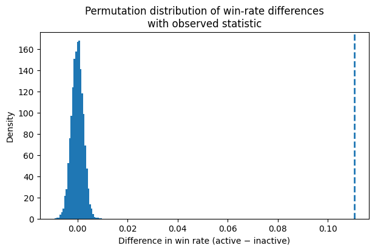
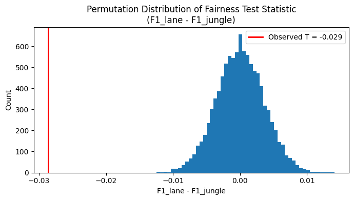

# Ganks, Gold, and Game Outcomes: Early Jungle Impact in Pro League of Legends

by Hoang Anh Pham and Lam Hoang

---

## Introduction
League of Legends is a multiplayer strategy game where early decisions can shape the entire outcome of a match. Among the five roles on a team, the jungler has a unique impact on early momentum: they control neutral objective, apply pressure on every lane, and create advantages through early kills or assists. Because of this, the community often raise a debate how much early jungler activity actually influences the chances of wining.

This project investigates this question using professional League of Legends match data from 2014 to 2025. We examine whether early jungle involvement, measured by kills or assists within the first ten minutes, is linked to a higher chance of winning. By comparing win rates in games where the jungler, is active with at least one kill or assist at 10 minutes vs. inactive with zero kills/assists, we quantify the jungler's early impact and how early skirmishes shape a match.

This analysis uses exploratory data analysis, statistical testing, and visualization to determine whether early jungle success provides a real competitive advantage or if its importance is overstated compared to later objectives, team compositions, and macro decisions.

## Data Cleaning and Exploratory Data Analysis
For the League of Legends' datasets, we decided to assess the commmon columns and chose out 31 columns to perform EDAs with. We also dropped columns that are explainable by other columns and columns that are completely NAs since those do not directly influence our analysis for this subject matter. 

To understand the influence of jungle activity, we investigate the gold difference at the 10-minute mark across roles in the game.

<iframe
  src="{{ site.baseurl }}/assets/gold-diff-at-10-by-role.html"
  width="800"
  height="500"
  frameborder="0">
</iframe>

Across all roles, the distribution of early gold difference appears similar. No role consistently dominates or falls behind at 10 minutes, suggesting that early-game performance varies mainly from game-to-game rather than being role-driven. This motivates examining other factors such as jungle presence to explain early advantages.

<iframe
  src="{{ site.baseurl }}/assets/gold-diff-at-10.html"
  width="800"
  height="500"
  frameborder="0">
</iframe>

Although each role has a distinct function in League of Legends, their early-game gold differences at 10 minutes follow almost the same distribution. No lane consistently wins or loses early, which suggests that factors beyond the role, such as jungle interactions, matchup specifics, or early objectives, play a larger role in shaping early advantages.

When the jungler is active before 10 minutes, lanes tend to have a higher gold difference at 10 compared to lanes without jungle activity. The median lane with no jungle activity is slightly behind in gold, while lanes with jungle activity are closer to or above even, although there is still substantial overlap between the two groups.

| Position | Kills @10 | Assists @10 | Deaths @10 |
|----------|-----------|-------------|------------|
| Bot      | 0.469483  | 0.488984    | 0.343891   |
| Jng      | 0.577716  | 0.789757    | 0.432768   |
| Mid      | 0.429856  | 0.473241    | 0.354235   |
| Sup      | 0.196074  | 0.940890    | 20.460307  |
| Top      | 0.341712  | 0.356045    | 0.432574   |

This table compares early-game combat involvement across roles by looking at average kills, assists, and deaths at 10 minutes. Junglers stand out with the highest early kills and the second-highest assists, reflecting their role in influencing multiple lanes. Supports also show high assist numbers despite having very few kills, highlighting their team-oriented early playstyle. Laners such as top, mid, and bot have similar kill and death rates, while teams overall accumulate the most early action due to their summary rows.

## Assessment of Missingness
<iframe
  src="assets/missingness-firstbloodassist-vs-killsat10.html"
  width="800"
  height="500"
  frameborder="0"
></iframe>

The difference in average `killsat10` between rows where `firstbloodassist` is missing vs. not missing is much larger than would be expected by random chance. Players who assist First Blood tend to be in roles (Jungle, Mid, Support) that are also highly involved in early skirmishes, whch increases kills before 10 minutes. Therefore, the missingness of `firstbloodassist` likely depends on killsat10, indicating that the missingness is MAR with respect to this variable.

<iframe
  src="assets/missingness-firstbloodassist-vs-csdiffat10.html"
  width="800"
  height="500"
  frameborder="0"
></iframe>

We can see that the observed statistic lies near the center of the permutation distribution for `csdiffat10`. This indicates that there is no significant difference in average CS difference at 10 minutes between rows where `firstbloodassist` is missing and rows where it is not missing. Creep score differences reflect individual laning performance and are unrelated to whether a player participated in the First Blood assist. Therefore, the missingness of `firstbloodassist` does not depend on `csdiffat10`, suggesting it is MCAR with respect to this feature.

## Hypothesis Testing

### Research Question
Does early jungle improvement (kills or assists within the first 10 minutes) increase a team's likelihood of winning in professional *League of Legends* matches from 2014–2025?

### Hypotheses
**Null Hypothesis (H₀):** Early jungle involvement (kills or assists within the first 10 minutes) does not affect a team’s win rate.  

**Alternative Hypothesis (H₁):** Teams with early jungle involvement (at least one kill or assist within the first 10 minutes) are more likely to win.

### Test Statistic
We use the difference in win rates:

`T = p_active − p_inactive`

where:
- `p_active` = win rate when the jungler has **≥ 1** kill/assist at 10 minutes  
- `p_inactive` = win rate when the jungler has **0** kills and **0** assists at 10 minutes  

### Significance Level
We use a significance level of **α = 0.10**.

A 10% threshold is reasonable in competitive gaming analytics because matches are high-variance (draft, coordination, meta shifts). Missing a real early-game effect can be more costly than allowing a slightly higher false positive rate.

### Data Filtering and Feature Engineering
Before testing, we filter to **only junglers** (`position == "jng"`).  
We then create an “active jungler” indicator:

`active = (killsat10 + assistsat10) > 0`

### Observed Statistic
- Win rate with **active** junglers: **0.544**
- Win rate with **inactive** junglers: **0.433**
- Observed difference: **T_obs = 0.111**

We performs a permutation test to compute the difference between active and inactive junglers with 10000 times. None of the 10000 permutated test statistics were as large as the observed difference in win rates. The computed p-value from the permutation distribution was return as 0.0.

At the α = 0.10 significance level, the p-value from the permutation test was less than 0.0001. Since p < α, we reject the null hypothesis. The data provides strong statistical evidence that teams whose jungler participates in at least one early kill or assist are more likely to win the game compared to teams whose jungler is inactive during the early game.

## Prediction Problem
**Can we predict whether a team will win the game using only early-game information available by the 10-minute mark?**

This prediction problem aligns naturally with our overall research question about whether early jungle impact influences match outcoms. It also reflects a realistic analysis scenario: we want to evaluate win probability using only information known at the time of prediction, in this case, the first 10 minutes of the game.

### Features Available at 10 Minutes

To ensure we only use information available at prediction time, we restrict features to statistics that exist **at or before the 10-minute mark**.

| Feature | Why Choosen |
|---------|-------------------|
| `goldat10` | Known by minute 10 |
| `xpat10` | Known by minute 10 |
| `csat10` | Known by minute 10 |
| `golddiffat10` | Derived from pre-10 stats |
| `xpdiffat10` | Derived from pre-10 stats |
| `csdiffat10` | Derived from pre-10 stats |
| `killsat10` | Early skirmish outcomes |
| `assistsat10` | Early skirmish outcomes |
| `deathsat10` | Available by minute 10 |
| `firstblood`, `firstbloodkill`, `firstbloodvictim` | Occur before or at 10 minutes |

## Baseline Model
For the baseline model, we used a Logistic Regression classifier to predict game outcomes (result). The model includes five features: golddiffat10, xpdiffat10, csdiffat10, firstblood, and side. Among these features, golddiffat10, xpdiffat10, and csdiffat10 are quantitative variables that capture early-game economic and resource advantages at 10 minutes. Since these variables are already on comparable numeric scales, we applied passthrough preprocessing without additional scaling. The remaining two features, firstblood and side, are categorical variables. We applied one-hot encoding to these features, dropping the first category to avoid multicollinearity.

We split the data into training and testing sets using an 80/20 stratified split to preserve the class distribution of the target variable. After fitting the model on the training data, the baseline Logistic Regression model achieved an **accuracy of 0.622** and an **F1-score of 0.61**8** on the test set. These results indicate that the model performs moderately better than random guessing, suggesting that early-game gold, experience, and CS advantages provide meaningful predictive signal for match outcomes. However, the overall performance remains limited, highlighting substantial room for improvement through incorporating additional features and exploring more expressive models or hyperparameter tuning in subsequent sections.

## Final Model
In our final model, we introduced two engineered early-game features: `kpa10` and `kda10`. The feature `kpa10`, defined as the sum of kills and assists at 10 minutes, captures a player’s early-game participation in team fights and skirmishes, which is especially important for jungle players whose impact often comes from ganks and map pressure rather than lane farming alone. The feature `kda10`, defined as 
(killsat10 + assistsat10) / max(1, deathsat10), reflects early-game efficiency by balancing offensive contribution against deaths. We believe these two features better represent early jungle influence and decision-making, allowing the model to capture nuances of gameplay that raw statistics alone may miss.

Our final model uses a `Random Forest Classifier`, consistent with our modeling approach, but now enhanced with engineered features. The full feature set includes early-game economic and resource differences (`golddiffat10`, `xpdiffat10`,`csdiffat10`), combat statistics (`killsat10`, `assistsat10`, `deathsat10`), the engineered features (`kpa10`, `kda10`), and contextual categorical variables (`firstblood` and `side`). All quantitative features were passed through without scaling, while categorical features were encoded using `One-Hot Encoding`. To improve model performance, we conducted grid search cross-validation to tune key hyperparameters of the `Random Forest`, including the number of estimators, maximum tree depth, and minimum samples required to split a node. The optimal parameters found were **200 estimators**, a maximum depth of 5, and a minimum samples split of 5.

After training and tuning, the final model achieved a **test accuracy of 0.624** and an **F1-score of 0.626**, improving upon the baseline model in both metrics. The confusion matrix shows a more balanced performance between predicting wins and losses, indicating better precision-recall trade-offs. While the improvement is modest, the gain demonstrates that incorporating domain-specific feature engineering meaningfully enhances predictive performance. Overall, this final model highlights the importance of early-game participation and efficiency in determining match outcomes, while also leaving room for future improvements through additional contextual or temporal features.

## Fairness Analysis

In this section, we assess whether our final model performs fairly across different player roles. Specifically, we aim to answer the following question:

**Does our model perform worse for jungle players than it does for lane players?**

Since our research question focuses on the impact of early jungle involvement on match outcomes, it is important to verify that the model does not systematically disadvantage or favor junglers when making predictions.

We divide the test data into two groups based on player position:

- **Jungle group:** players whose position is `jng`
- **Lane group:** players whose position is `top`, `mid`, `bot`, or `sup`

Team-level rows are excluded to ensure the comparison focuses only on individual player roles.

### Hypotheses

- **Null Hypothesis (H₀):**  
  The model is fair. The F1-score for jungle players is the same as the F1-score for lane players.

- **Alternative Hypothesis (H₁):**  
  The model is unfair. The F1-score for jungle players is different from the F1-score for lane players.

### Test Statistic

The test statistic is defined as the difference in F1-scores between the two groups:

`T = F1_lane − F1_jungle`

From the observed data:
- **F1 (Jungle):** 0.633  
- **F1 (Lane):** 0.604  

This yields an observed test statistic:

`T_obs = -0.0287`

---

### Permutation Test Results

To evaluate the statistical significance of this difference, we conducted a **permutation test with 10,000 permutations**, randomly shuffling group labels and recomputing the test statistic under the null hypothesis.

- **Permutation p-value (one-sided):** 1.000

Since the p-value is much larger than the significance level of 0.05, we **fail to reject the null hypothesis**.

---

### Conclusion

There is no statistically significant evidence that the model performs differently for jungle players compared to lane players. Therefore, our final model appears to be **fair across player roles**, exhibiting no measurable bias against junglers in terms of predictive performance.
